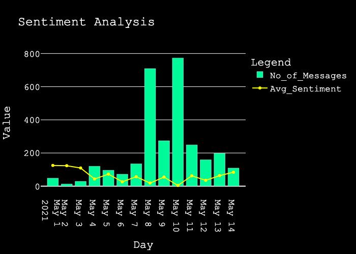

# Objective: To scrape data from a Telegram group and do sentiment analysis on crawled data and perform first analysis on it to find insights.

#### Work Submitted By: Paritosh Singh (paritosh@usc.edu) 
M.S. Degree in Computer Science (Artificial Intelligence), University of Southern California

## Structure of Directory:

1. data
    1. result.json - the raw JSON data file from telegram API
    2. telegram_processed_data.csv - containing initially processed data for sentiment analysis
    3.  telegram_visualization_data.csv - containing processed data for visualization
2. images
    1. plot.png - contains the main plot
    2. plot_hist.png - contains the histogram for summary
    3. plot_hist_without_zero - contains another histogram for summary
3. requirements.txt - contains package dependencies
4. readm.md - documentation/summary
5. preprocessing.py - script for preprocessing
6. sentiment_analysis.py - script for sentiment_analysis
7. visualization.py - script for visualization

## Results Reproduction:

1. Code runs with python3.6+
2. All necessary library dependencies are in requirements.txt
3. Run following on the Command-Line to reproduce results:
    1. python3 preprocessing.py data/result.json
    2. python3 sentiment_analysis.py data/telegram_processed_data.csv
    3. python3 visualization.py data/telegram_visualization_data.csv

## Data Source 

Data was exported from a Telegram Group: https://t.me/CryptoComOfficial

Messages from dates May 1 to and including May 15, 2021, were scrapped using the official Telegram API.

## Code Description:

## Pre-Processing
1. The JSON file is processed to extract raw data and store it.
2. Raw data is converted to a data frame and processed to filter non-English characters.
3. Messages containing SHIB and DODGE are kept.

## Sentiment Analysis
1. Sentiment Analysis is done using the nltk library.
2. The built-in, pretrained sentiment analyzer called VADER (Valence Aware Dictionary and sEntiment Reasoner) was utilized for sentiment analysis. VADER is tuned for social media linguistics.
3. Since the goal of the project is to perform first analysis on the dataset, nltk(VADER) is chosen for quick and preliminary exploratory analysis.
    
## Visualization
1. A simple script to generate visualizations from processed code. 
2. Visualizations are generated in plotly.
3. For better visualizations sentiment range from -1 to +1 is extended to -1000 to +1000.
    
## Summary

### Analysis 1

  

    
     
    Figure 1
  

 

  1. The general trend observed is that from May 3 to May 7 the number of messages discussing SHIB and DODGE were less than 10.
  2. The total number of messages discussing SHIB and DODGE on May 1, 2, and 15 are zero.
  3. The total number of messages per day peaks on May 10 and then dwindles until May 15.
  4. Another peak can also be observed on May 8th coming as the second-highest day with messages mentioning SHIB and DODGE.
  5. The sentiment hits a peak on May 4th and decreases till May 7th.
  6. Overall the sentiment is positive for the whole duration except for May 7th.
  7. Thereafter, the sentiment improves and does a middling job at growing until May 14th. 
  8. However, growth in a positive direction can be noted from May 7th to 14th.

 

### Analysis 2

    
     
    Figure 2
     
     
     
    
     
    Figure 3
  

  1. The histogram based of the sentiment value of each message shows insightful results.
  2. Most messages were of a neutral tone as can be seen in the peak in the Figure 2.
  3. However, Once the neutral values are removed we get a better idea of distribution (Figure 3).
  4. Most other messages are evenly(approximately) distributed around two peaks at -0.5 and 0.5.
  5. Positive sentiment messages have a higher peak than negative messages thus displaying the overall positive sentiment for most of the time series.

